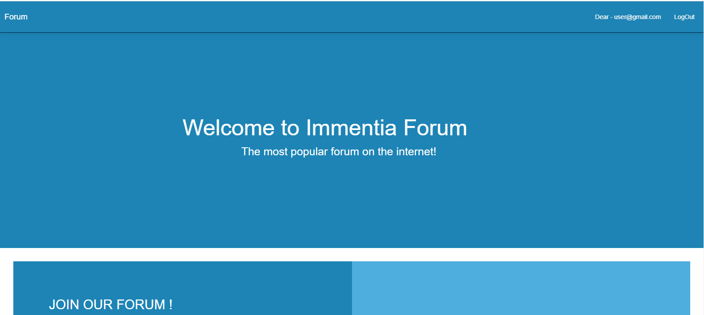
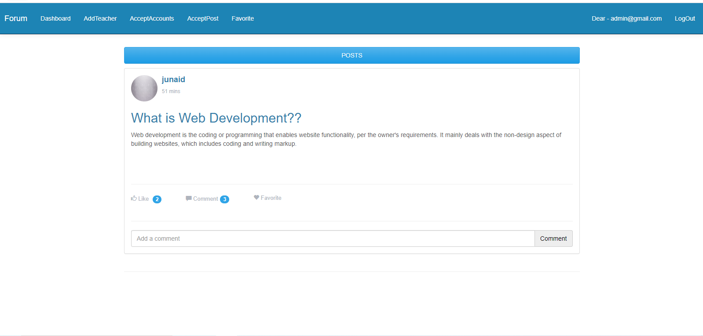
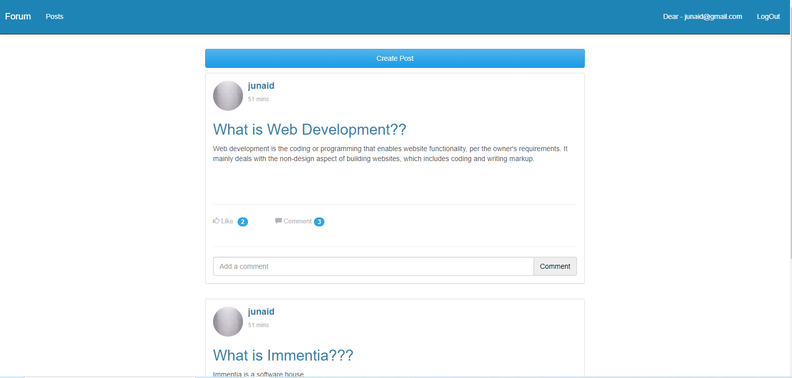
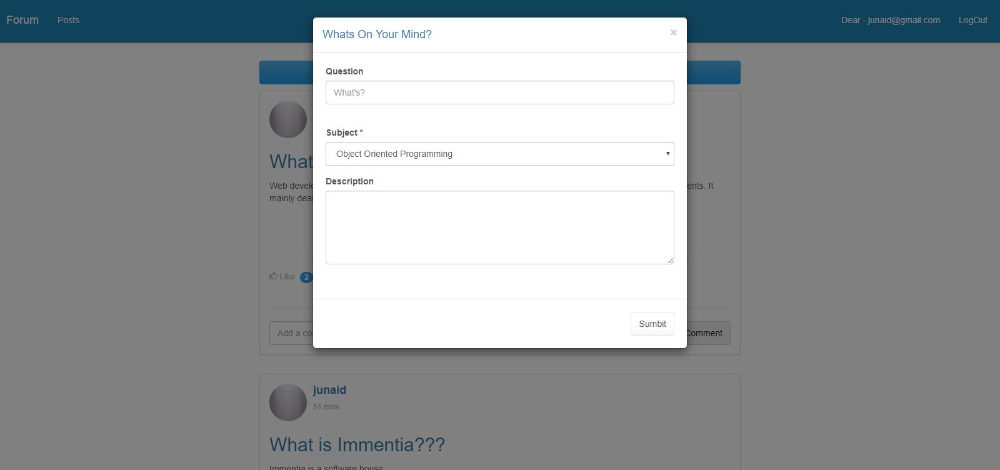

Project description
The system comprises of 4 major modules with their sub-modules as follows:

✅ Admin:
a. Login: Canteen person need to login using valid login credentials to access the system.
b. Add Teacher: System allows admin to add teacher with their details such as name, email,
contact, etc…
c. Approve Student / Alumni: Students/Alumni, who have registered themselves successfully,
will be sent to admin for approval of an account. Once the admin approve the registration
then only Student/Alumni can access their account.
d. Accept Thread: Whatever thread/post is added by the teacher/student/alumni will be first
sent to admin for approval. Once admin approve the thread/post, it can be viewable to all.
e. View Thread: Admin can view all the accepted thread/post with its details and mark any
thread/post as favorite.

✅ Teacher:
a. Login: A Teacher need to login using valid login credentials to access the system.
b. Create/View Thread: A teacher can create a thread by mentioning the thread content,
which will be sent to admin for approval. All the threads added by the teacher can be
viewable once it is approved by the admin.

✅ Alumni:
a. Register: The alumni person need to register himself/herself with basic registration details
and need to create a valid login id and password.
b. Login: Alumni person need to login using valid login credentials to access the system.
c. Create/View Thread: An alumni person can create a thread by mentioning the thread
content, which will be sent to admin for approval. All the threads added by the person can
be viewable once it is approved by the admin.

✅ Student:
a. Register
b. Login: A Student need to login using valid login credentials to access the system.
c. Create/View Thread: A student can create a thread by mentioning the thread content,
which will be sent to admin for approval. All the threads added by the student can be
viewable once it is approved by the admin

1- Home page of internet based discussion forum

2- Posts of internet based discussion forum

3- Likes, comments and favorite  of internet based discussion forum

4- Add posts of internet based discussion forum

